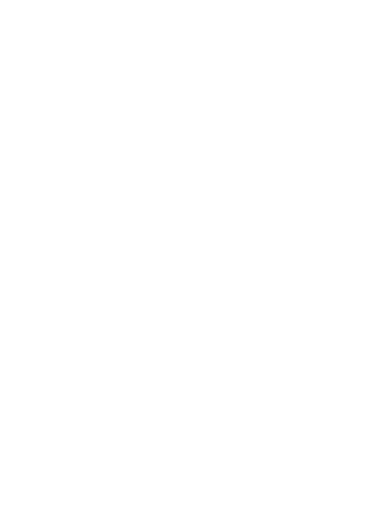

# Chess: The Game
 
 Authors: [Chloe Au](https://github.com/lumpydumpling), [Mario Bertumen](https://github.com/mahonaisse), [Jonathan Emmons](https://github.com/Jonathanace), [Charles O'Hagin](https://github.com/CharlesEOhagin)

## Description 📝
Chess is one of the oldest and most popular board games. Two people can play against each other, first choosing between the black or white side, then taking turns to move one of their pieces according to that piece's fixed rules. The game continues until a player's King piece is [checkmated](https://www.chess.com/terms/check-chess#:~:text=When%20a%20king%20is%20attacked,must%20get%20out%20of%20check!) or can no longer move out of harm of an opposing piece(s).

We wanted to create Chess because it is a simple, yet complex game. None of the information of the game is hidden at any time, so Chess becomes a game of strategic planning and improvisation. Trying to create such a game sounds exciting, and implementing more 'game' features, such as saving or loading a game, undoing a player's move, or playing against a computer, sound like a challenge and a great way for us to improve as programmers.

The project provides features that a person could play against another person. We would also like to keep track of the moves and the position of the board after a certain move. We would also like to make sure that the program follows all the special rules that are in chess like en-passant, castling, and promotion. If given enough time we would also like to add different game modes like suicide chess, bug house, crazy house, or atomic chess. We also might want to add daily puzzles from the internet. We would also like to potentially add an AI that might play in simple end-game positions against the player.

The inputs of the project will include navigational inputs for navigating the menu and selecting options from the menu. Additionally, the user will need to input their moves for the game. Outputs will include listing the menu options, and a way to visualize the chess board. Whether that be through ASCII art, a Python library, a C++ library, or something else entirely, we are not sure yet.

## Class Diagram

This [UML](https://www-sop.inria.fr/axis/cbrtools/usermanual-eng/Print/UMLNotationPrint.html#:~:text=The%20UML%20notation%20is%20a,classes%2C%20objects%20and%20sequence%20diagrams) diagram represents the classes and functions that we plan to implement to develop a working game of Chess. We first have `ChessGame` as the main class that all classes will be derived from. The `ChessGame` class has functions such as `play()` and `loadGame()` that allow users to play or continue a game of Chess. There is also `newGame()` that lets users start a fresh game of Chess and `quit()` that will quit the program. The `ChessGame` class has at least one player and either another player or a CPU as part of the `Player` class, and a board with pieces as part of the `Board` and `Piece` class.

Each `Player` class will have their `name` as a string and vector of all of their Chess pieces. Each player then has a function called `playTurn()` where the player will move one of their pieces. Player 1, Player 2, and CPU classes are all derived from `Player` class. CPU has a function called `randomMove()` which will make a legal random move.

The `Board` class is a 2-dimensional array that will contain every `Piece`. After a valid move is made, the `Board` class will the function `updateBoard()` to update the pieces on the board. `constructBoard()` will construct a new board compliant with tournament rules. `check()` will see if the current position has a check, and `checkmate()` will see if the current position has a checkmate.

The `Piece` class is an abstract class; it will allow all subclasses or, rather, all pieces to keep track of their position on the board with `rowPos` and `columnPos`, as well as if that piece is black or white with `color`. There is also the `type` as a data member, that determines which of the six subclasses that piece will use, so that the piece will moving according to its type. It then has the three functions: `moveIsLegal()` where it checks if the move is [legal](https://chess.org/rules), `moveTo()` where a piece would move to a place only if `moveIsLegal()` returns true, and `die()` when a piece gets captured by an enemy piece. Pawn, Bishop, King, Rook, Queen, and Knight are all subclasses from the `Piece` class, so these classes will derive the functions and members from `Piece`. King is another subclass of `Piece`, but has `checkmate()` instead of `die()` that will help determine if a player has yet to lose the game.
 
 > ## Phase III
 > You will need to schedule a check-in for the second scrum meeting with the same reader you had your first scrum meeting with (using Calendly). Your entire team must be present. This meeting will occur on week 8 during lab time.
 > * Before the meeting you should perform a sprint plan like you did in Phase I.
 > * You should also make sure that your README file (and Project board) are up-to-date reflecting the current status of your project and the most recent class diagram. Previous versions of the README file should still be visible through your commit history.
> 
> During the meeting with your reader you will discuss: 
 > * How effective your last sprint was (each member should talk about what they did)
 > * Any tasks that did not get completed last sprint, and how you took them into consideration for this sprint
 > * Any bugs you've identified and created issues for during the sprint. Do you plan on fixing them in the next sprint or are they lower priority?
 > * What tasks you are planning for this next sprint.

 
 > ## Final deliverable
 > All group members will give a demo to the reader during lab time. ou should schedule your demo on Calendly with the same reader who took your second scrum meeting. The reader will check the demo and the project GitHub repository and ask a few questions to all the team members. 
 > Before the demo, you should do the following:
 > * Complete the sections below (i.e. Screenshots, Installation/Usage, Testing)
 > * Plan one more sprint (that you will not necessarily complete before the end of the quarter). Your In-progress and In-testing columns should be empty (you are not doing more work currently) but your TODO column should have a full sprint plan in it as you have done before. This should include any known bugs (there should be some) or new features you would like to add. These should appear as issues/cards on your Project board.
 > * Make sure your README file and Project board are up-to-date reflecting the current status of your project (e.g. any changes that you have made during the project such as changes to your class diagram). Previous versions should still be visible through your commit history. 
 
 ## Screenshots
 > Screenshots of the input/output after running your application
 ## Installation/Usage
 > Instructions on installing and running your application
 ## Testing
 > How was your project tested/validated? If you used CI, you should have a "build passing" badge in this README.

For pieces.py, we tested isValidMove() for every chess piece which returns false or calls canMoveOrCapture(). We set up the piece and player1 and player2 moves. Pawn has special capture moves to check the pawn's ability to move based on the player piece and the player's opponent piece location. For every move, we tested valid and invalid moves. We tested isValidMove() will return "capture" for knight and pawn. This function is similarly called for other pieces. 

For player.py we tested movePiece() for 5 different outcomes- True, False, stalemate, checkmate, and checked.
 
