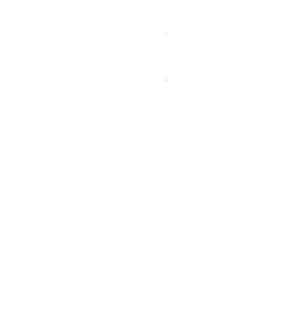
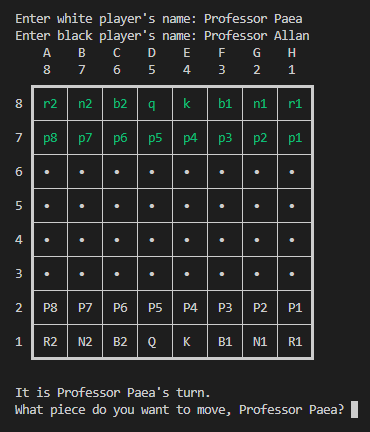
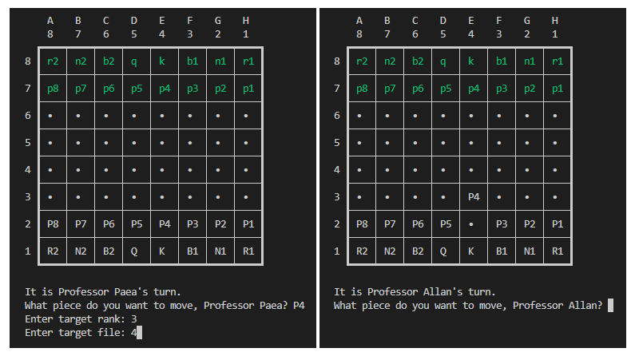
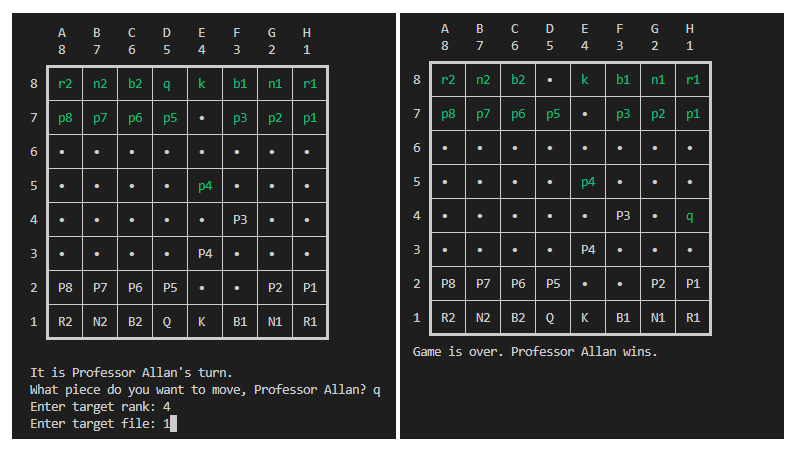

[](https://classroom.github.com/online_ide?assignment_repo_id=8880745&assignment_repo_type=AssignmentRepo)


# Chess: The Game
 
 Authors: [Chloe Au](https://github.com/lumpydumpling), [Mario Bertumen](https://github.com/mahonaisse), [Jonathan Emmons](https://github.com/Jonathanace), [Charles O'Hagin](https://github.com/CharlesEOhagin)


## Description 📝
Chess is one of the oldest and most popular board games. Two people can play against each other, first choosing between the black or white side, then taking turns (with white going first) to move one of their pieces according to that piece's fixed rules. The game continues until a player's King piece is [checkmated](https://www.chess.com/terms/check-chess#:~:text=When%20a%20king%20is%20attacked,must%20get%20out%20of%20check!) or can no longer move out of harm of an opposing piece(s).

We wanted to create Chess because it is a simple, yet complex game. None of the information of the game is hidden at any time, so Chess becomes a game of strategic planning and improvisation. Trying to create such a game sounds exciting, and implementing more 'game' features, such as saving or loading a game, undoing a player's move, or playing against a computer, sound like a challenge and a great way for us to improve as programmers.

The project provides features that a person could play against another person. We would also like to keep track of the moves and the position of the board after a certain move. We would also like to make sure that the program follows all the special rules that are in chess like en-passant, castling, and promotion. If given enough time we would also like to add different game modes like suicide chess, bug house, crazy house, or atomic chess. We also might want to add daily puzzles from the internet. We would also like to potentially add an AI that might play in simple end-game positions against the player.

The inputs of the project will include navigational inputs for navigating the menu and selecting options from the menu. Additionally, the user will need to input their moves for the game. Outputs will include listing the menu options, and a way to visualize the chess board. Whether that be through ASCII art, a Python library, a C++ library, or something else entirely, we are not sure yet.


## Class Diagram 


This [UML](https://www-sop.inria.fr/axis/cbrtools/usermanual-eng/Print/UMLNotationPrint.html#:~:text=The%20UML%20notation%20is%20a,classes%2C%20objects%20and%20sequence%20diagrams) diagram represents the classes and functions that we plan to implement to develop a working game of Chess in Python. `main.py` implements an interface `Board` and the game through `Player`.
`Board` is directly associated with `Player`, as players use the board to play chess. A player is composed of `Piece`'s and other parts like `color`, `name`. As such, a player is no longer player without pieces. Piece is the base class that `Pawn`, `Knight`, etc. are derived and inherit from.

In the `Board.py` file we have `buildBoard(player1,player2)` which creates a board based on the location of all the pieces of `player1` and `player2`. `displayBoard(player1, player2)` displays the board in a more traditional way where white is on bottom and black is on top, and `displayBoardRevers(player1,player2)` displays it in reverse so that white is on top and black on bottom.

In the `Player` class, we have the variables: `name`, `color`, and a list of `piece`'s. The player `__init__` constructor takes in a name and color and initializes the list of pieces that the player will control based on their color. The function `findsPieceByName(self, pieceName)` finds the piece object that has the same piece name. This function isn’t case-sensitive. The function `findPieceByRankAndFile(self, atRank, atFile)` finds the piece object that is `atRank` and `atFile`. The function `promote(self, pawn, promoteTo)` takes a pawn piece and promotes it to a Rook, Knight, Bishop, or Queen. In the function `movePiece pieceName, toRank, toFile, opponent)`, it moves the piece only if it is a valid move. The `movePiece()` function returns checkmate, check, capture, promotion, stalemate, or invalid move if any of these conditions occur. This function calls upon the piece it is moving to see if it's a valid move and if it's a capture, you must remove an opponent's piece. If it's a promotion, you promote the pawn to a queen. Then you check if the player checked or checkmated the opponent. And if it wasn’t a valid move you return invalid move. The function `removePiece(self, atRank, atFile)` removes a piece from the piece list that is at that rank and file. The function `updatePiece(self, piece, atRank, atFile)` updates the piece so that its at its new rank and file.

The function `isCheck( self, opponent, checkingPiece)` checks to see if a player is checking their opponent. The function `isCheckMate(self, opponent, checkingPiece)` checks to see if a player is in checkmate. The function is `stalemate(self, opponent)` and sees if the two players are in a stalemate. The function `canGetOutOfCheckByCapture(self, opponent, checkingPiece)` checks if any of the opponent's pieces beside the opponent king can capture the checking piece. The function `canGetOutOfCheckKingByMove(self, opponent)` checks if the opponent `King` can make any legal move. The function `canGetOutOfCheckByBlock(self,  opponent, checkingPiece)` checks to see if any of the opponents can block the check. The function `canAnyPieceCaptureKing (self , opponent, oppKingRank, oppKingFile)` checks to see if any of the player's pieces can “capture” the opposing king. The `potentialNextMove(self, opponent, kingToRank, kingToFile)` checks possible what if moves by the king to see if they are legitimate or not. `__str___(self)` prints out the string representation of the `Player` class. 

The `Piece` class has the variable `name`, `color`, `pRank`, and `pFile`, which are passed into the constructor `__init__` respectively. `__str__(self)` function prints out the string representation of the Piece Class. `__repr__(self)` returns a string of an object that can be used to reconstruct the original object. It also has `isValidMove(self, moveToRank, moveToFile, board)` that all its child’s classes inherit. The children's class of Piece are `Pawn`, `Knight`, `Bishop`, `Rook`, `Queen`, and `King` and all of their `isValidMove()`'s are different. This is because they all have different means of moving around. The function `canMoveOrCapture(self, moveToRank, moveToFile, board)` returns `False` if `board[moveToRank][moveToFile]` has a piece of its only color is there, true if there `board[moveToRank][moveToFile]` has `None` in there and capture if `board[moveToRank][moveToFile]` has an opponent piece in there. 


 ## Installation/Usage (Python versus C++)

 We chose to use Python over C++ for several reasons. The main reason is because most of our group members are Data Science majors, thus they have more experience in Python and are able to help the few members who do not know how to code in Python. Data Science majors, as well as our group for this project, prefer to use Python for its simplicity to learn and its more readable code. Python is made easy-to-learn and understand through its dynamic typing, automatic memory management, and automatic data type declaration for variables.
 
 This is as opposed to C++ which is a bit more complex, as the language holds more syntax rules, programming conventions, and memory management. C++ takes preference over Python when speed and compilation time matter more than readability, but this should only matter in larger projects and resource-heavy applications, such as video games. 
 
 To run the game, all you need to do run `python3 main.py` in your terminal once you download this repository or at least the files: `main.py`, `board.py`, `pieces.py`, and `player.py`. 

 There is no need to compile all the files together through a long line in your terminal or through the CMake tool as is done when coding in C++.

 To install the `pytest` library, run `pip3 install pytest --user` int your terminal. To run your test files, run `python3` on those files, such as `python3 test_board.py`.

 ## Screenshots of a [Fool's Mate](https://www.chess.com/terms/fools-mate)
 

 White player's piece are in white, and black player's pieces are in sea green. This is an example of our Chess Game, and what is first prompted to the users when starting a new game. The users are prompted to put in their names for the white and black chess player, then the game begins with the white player going first.




A turn is made by a player by first inputting the piece that player wants to move, followed by that piece's target rank (vertical numbers), then by that piece's target file (horizontal numbers). This is shown in the left image, where Professor Paea moves `P4` (or Pawn 4) to rank `3` and file `4`. Professor Paea's and every player's input during their turn is validated, making sure that they selected their own color's piece, a piece is alive and available, and that their selected piece can move in such a direction and distance and does not take their own color's piece, otherwise they will be prompted to make their move again. Once their move has been validated, the display of the chess board is updated and prompts the next player to do their move.




The game alternates between the white and black players, until one player is checkmated and the other player wins. The image on the left is the final move by Professor Allan, our black player, to a game similar to a [Fool's Mate](https://www.chess.com/terms/fools-mate), and the resulting board and winner are displayed in the right image.


 ## Testing using [pytest](https://docs.pytest.org/en/7.2.x/index.html)

 Please refer above to the bottom of the Installation/Usage section to install and run the `pytest` library.

> How was your project tested/validated? If you used CI, you should have a "build passing" badge in this README.

For pieces.py, we tested isValidMove() for every chess piece which returns False for invalid moves, or calls on canMoveOrCapture() which returns True or "capture". For every chess piece, we tested valid and invalid moves. We tested that isValidMove() will return "capture" for pawn and knight. Pawn has special and more elaborate capture scenarios so we had multiple pawn tests. 

For player.py, we tested movePiece() for checked and invalid moves. movePiece() calls on the isCheckMate() function to check if the king can't get of check, can't block, and can't run.


 ## Unimplemented/Future Interfaces
```
1                  chess: the game
2
3                         _:_
4                        '-.-'
5                       __.'.__
6  [O] 1 player        |_______|
7                       \=====/
8  [T] 2 players         )___(
9                       /_____\
10 [L] load game         |   |
11                       |   |
12 [H] how to play       |   |
13                       |   |
14 [Q] quit              |   |
15                      /_____\
16                     (=======)
17                     }======={
18                    (_________)
19 
20 What do you want to do? []
```
We planned to but did not use this interface as we saw no need to. Our current project only allows games of two players, with each player inputting their names, pieces, and moves one by one. Even if we implemented ingame chess features such as [castling](https://www.chess.com/lessons/playing-the-game/castling), doing so would not call for creating an interface, as the game is processed in `player.py` and `pieces.py` and displayed through `board.py`. We would only need to implement this interface if and when we create more options to playing chess, such as with one player versus a CPU, loading a saved game, learning how to play, or saving and quitting.
